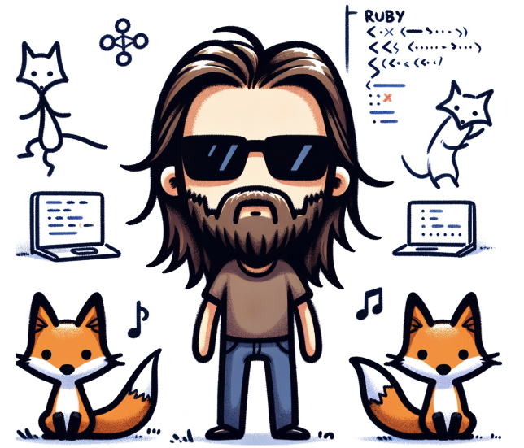

# Extending _why's Legacy



The leading mission for Scarpe has been to implement as much backwards compatibility as possible for _why's original
Shoes library. This remains true. _why's taste and DSL are celebrated and preserved. However, at the discretion of
core maintainers, new features may be added. They must be approved by Noah Gibbs or Nick Schwaderer, and described
in this file. They cannot conflict or damage backwards compatibility with the original Shoes library.

## Page Navigation

Similar to URL navigation. see `url_navigation_single_app.rb` for an example. Unlike URLs, they do not accept parameters,
only the name of the page. They are simply declared and named in blocks.

```ruby
Shoes.app do
  page(:home) do
    title "Home Page"
    para "Welcome to the home page"
    button "Go to another page" do
      visit(:another_page)
    end
  end

  page(:another_page) do
    title "Another Page"
    para "Welcome to another page"
    button "Go to home page" do
      visit(:home)
    end
  end
end
```
