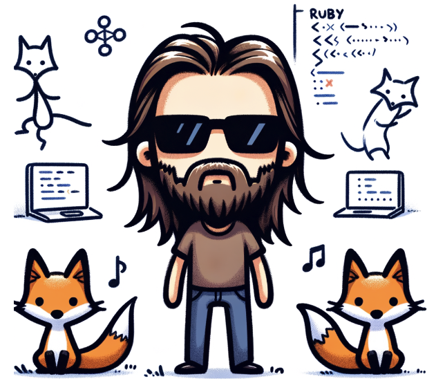

# Extending _why's Legacy



The leading mission for Scarpe has been to implement as much backwards compatibility as possible for _why's original
Shoes library. This remains true. _why's taste and DSL are celebrated and preserved. However, at the discretion of
core maintainers, new features may be added. They must be approved by Noah Gibbs or Nick Schwaderer, and described
in this file. They cannot conflict or damage backwards compatibility with the original Shoes library.

## Page Navigation

Similar to URL navigation. see `url_navigation_single_app.rb` for an example. Unlike URLs, they do not accept parameters,
only the name of the page. They are simply declared and named in blocks.

```ruby
Shoes.app do
  page(:home) do
    title "Home Page"
    para "Welcome to the home page"
    button "Go to another page" do
      visit(:another_page)
    end
  end

  page(:another_page) do
    title "Another Page"
    para "Welcome to another page"
    button "Go to home page" do
      visit(:home)
    end
  end
end
```

## Running a program in a process of its own

`Shoes.run_program(path, dir:, args:)` starts another Shoes program in a process of its own, on
the same Ruby and Scarpe, and returns a `Shoes::Program`: `pid`, `running?`, `stop`, and blocks for
its output, its errors and its end. A program that never stops freezes only itself. Approved by
Nick Schwaderer on 28 Sep 2026, for Hackety Hack's Run button, which in Shoes 3 evaluated a
child's program inside Hackety Hack. On the native display only; the others run the program
inside the app, as Shoes 3 did, with a warning. `docs/native.md` shows it in use, and
`native/DESIGN.md` 5.5 has the protocol.

```ruby
Shoes.app do
  button "Run" do
    @game = Shoes.run_program("game.rb")
    @game.on_error { |err| alert "#{err["message"]} (line #{err["line"]})" }
  end
  button("Stop") { @game&.stop }
end
```

## Sound: `audio`

`audio(path, volume: 1.0)` is a sound with no picture of its own, and returns a `Shoes::Audio`:
`play` (from the start, or from where `pause` left it), `pause`, `stop`, `playing?` and
`volume=`. It is a built-in like `alert`, so any object can call it. WAV, MP3, Ogg Vorbis and FLAC
play. The manual's `video` plays an audio file the same way (`play`, `pause`, `stop`, `playing?`,
`autoplay: true`), as Shoes 3 did through VLC; Scarpe still shows no moving pictures. Asked for by
Andi Idogawa on 1 Oct 2026, so that apps such as `examples/native/kids/*` make sounds on every
platform rather than through macOS's `afplay`; awaits Nick Schwaderer's approval upstream.

The native renderer plays through the system's output (rodio: CoreAudio, WASAPI, ALSA); Niente and
the webview hand the file to the system's player (`afplay`, PowerShell's `SoundPlayer`, `paplay`
or `aplay`, which play WAV at least). `SCARPE_AUDIO_FILE` names a file that stands in for the
speakers: each command lands there as a line (`play /path/pop.wav`) and a played sound ends at once,
which is how `spec/run` and the test suites check sounds without making any.

```ruby
Shoes.app do
  @pop = audio("pop.wav", volume: 0.3)
  button("Pop") { @pop.play }
  button("Hush") { @pop.stop }
end
```

## Speech: `say` and `voices`

`say(text, voice: nil)` says text aloud and returns at once, with a `Shoes::Speech` that can
`stop` it and says whether it is still `speaking?`. `voices` names the voices the system has. Both
are built-ins. macOS speaks with `say`, Windows with its own voices (System.Speech, through
PowerShell), Linux with `espeak-ng`, `espeak` or `spd-say` if one is installed, and otherwise says
nothing, with a warning. Under `SCARPE_AUDIO_FILE` each utterance is a line there instead (`say
Hello`, or `say[Samantha] Hello` in a voice). Asked for by Andi Idogawa on 1 Oct 2026, with the
name `say`, for `examples/skip_ci/say.rb` and `parrot.rb`, which ran macOS's `say` themselves; awaits
Nick Schwaderer's approval upstream. An app that defines its own `say` (`examples/native/legendary/
pixel_pet`) keeps it.

```ruby
Shoes.app do
  @line = edit_line "Hello from Scarpe"
  list_box(items: voices) { |box| @voice = box.text }
  button("Speak") { say @line.text, voice: @voice }
end
```

## `Shoes.on_error`

`Shoes.on_error { |err| }` hears every error a handler, a timer or the program's startup raises,
as a Hash with String keys (`class`, `message`, `backtrace`, `path`, `line`, `during`), besides
the log line and the Shoes console's entry. The program goes on as before. Approved by Nick
Schwaderer on 28 Sep 2026, so an app can show its own errors in its own words; Shoes 3 only put
them in its console.
