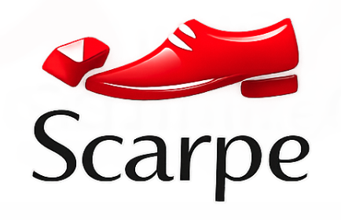

<div style="text-align: center; margin-bottom: 2rem;">
  
  <h1 style="margin-top: 1rem; font-size: 2.5rem; font-weight: 300;">Scarpe</h1>
  <p style="font-size: 1.4rem; color: #666; font-style: italic;">Scarpe Diem: Seize the Shoes</p>
</div>

---

**Scarpe** (Italian for "shoes") is a modern reimplementation of [Why The Lucky Stiff's Shoes](https://github.com/shoes/shoes-deprecated) — the beloved Ruby GUI toolkit that made desktop app creation accessible to everyone.

```ruby
Shoes.app do
  button "Click me!" do
    alert "Hello, Shoes!"
  end
end
```

That's it. That's a desktop app.

---

## Why Scarpe?

Shoes was magic. Write a few lines of Ruby, get a real desktop application. No frameworks, no build tools, no complexity. Just pure, joyful programming.

But old Shoes stopped working. Scarpe brings it back — built on modern Ruby and [Webview](https://github.com/niclas-pehrsson/webview_ruby), running on macOS, Linux, and Windows.

<div style="display: flex; flex-wrap: wrap; gap: 1rem; margin: 2rem 0;">
  <div style="flex: 1; min-width: 200px; padding: 1rem; background: #f8f8f8; border-radius: 8px;">
    <h3>Simple</h3>
    <p>Write desktop apps in pure Ruby. No ceremony, no boilerplate.</p>
  </div>
  <div style="flex: 1; min-width: 200px; padding: 1rem; background: #f8f8f8; border-radius: 8px;">
    <h3>Beautiful</h3>
    <p>Elegant DSL for layouts, text, images, shapes, and animations.</p>
  </div>
  <div style="flex: 1; min-width: 200px; padding: 1rem; background: #f8f8f8; border-radius: 8px;">
    <h3>Fun</h3>
    <p>Programming should be joyful. Scarpe keeps the whimsy alive.</p>
  </div>
</div>

---

## Quick Start

```bash
gem install scarpe

# Create hello.rb
echo 'Shoes.app { para "Hello, World!" }' > hello.rb

# Run it!
scarpe hello.rb
```

---

## A Taste of Scarpe

```ruby
Shoes.app(title: "My App", width: 400, height: 300) do
  background "#f5f5f5"

  stack margin: 20 do
    title "Welcome!"
    para "Scarpe makes GUI programming simple."

    flow do
      button("Say Hello") { alert("Hello!") }
      button("Goodbye") { exit }
    end
  end
end
```

Stacks and flows for layout. Buttons and text with one line each. Blocks for callbacks. Ruby as it should be.

---

## Documentation

<div style="display: flex; flex-wrap: wrap; gap: 1rem; margin: 1rem 0;">
  <a href="static/manual" style="flex: 1; min-width: 150px; padding: 1rem; background: #CC342D; color: white; text-align: center; border-radius: 8px; text-decoration: none;">
    <strong>The Manual</strong><br>
    <small>Complete reference</small>
  </a>
  <a href="documentation" style="flex: 1; min-width: 150px; padding: 1rem; background: #666; color: white; text-align: center; border-radius: 8px; text-decoration: none;">
    <strong>All Docs</strong><br>
    <small>Architecture & internals</small>
  </a>
  <a href="https://github.com/scarpe-team/scarpe" style="flex: 1; min-width: 150px; padding: 1rem; background: #333; color: white; text-align: center; border-radius: 8px; text-decoration: none;">
    <strong>GitHub</strong><br>
    <small>Source & issues</small>
  </a>
  <a href="https://discord.gg/Ca5EHSsGYp" style="flex: 1; min-width: 150px; padding: 1rem; background: #5865F2; color: white; text-align: center; border-radius: 8px; text-decoration: none;">
    <strong>Discord</strong><br>
    <small>Community chat</small>
  </a>
</div>

---

## In Memory

*Scarpe is developed in loving memory of [Noah Gibbs](https://codefol.io/), who believed in this project and whose thoughtful documentation lives on in every design decision.*

---

<div style="text-align: center; margin-top: 3rem; color: #999;">
  <p>Made with Ruby and whimsy.</p>
  <p><small>Scarpe is open source under the MIT license.</small></p>
</div>
